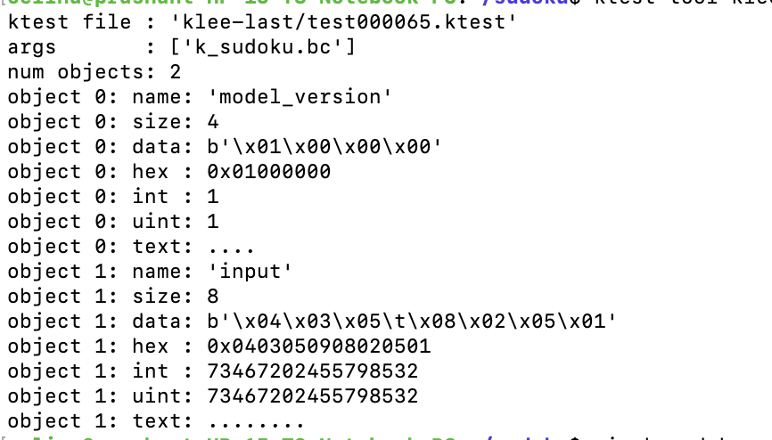
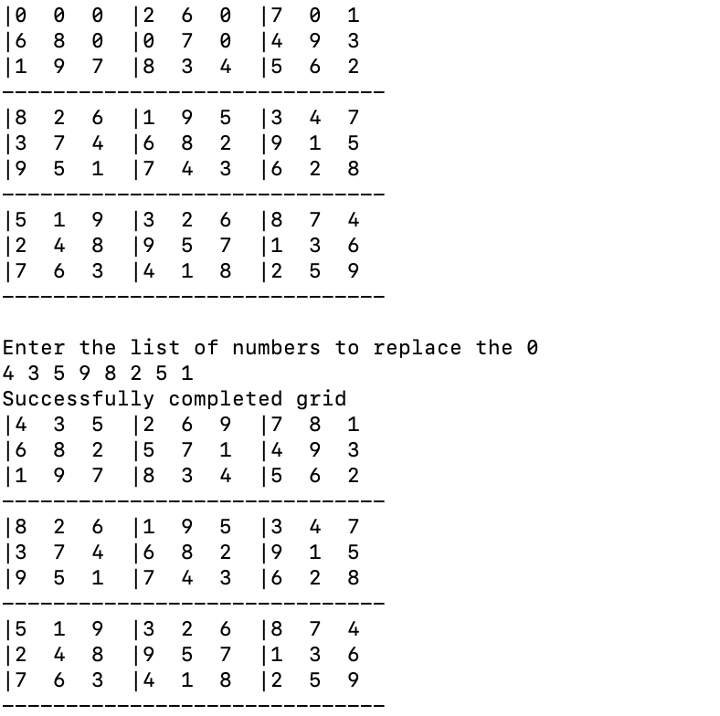

# Sudoku Solver with Klee
This program utilizes Klee, an open source constraint solver, to find the solution to a sudoku puzzle. 

### Requirements
This program is compiled with clang and needs the user to download klee as well (More information can be found on Klee's official Github: https://klee.github.io/
)

### Implementation
Simply run the .c file with the appropriate compilers

`clang k_sudoku.c` --> this will output a .bc file

And then run

`klee k_sudoku.bc` 

### Code
This program utilizes the constraint solver, Klee. Klee essentially utilizes symbolic execution to calculate all possible paths in a given program. Symbolic execution is a very powerful tool as instead of setting tangible values to variables, it uses symbols. THe program will continue execution and whenever a new path condition is reached, (usually in the form of an `if` statement) new constraints are added to the symbolic state until that condition not satisfiable. And then the engine backtracks and replaces some constraints with negation to reach other code paths.

In my program user input (which is where the user should input the numbers that will solve the sudoku board) is changed to a symbolic variable. Klee will set this `input array` as symbolic and run through all possible combinations. If at any time throughout the program ,the number inputed will result in an invalid sudoku board, the main program will exit and return a non-zero exit code. In order to find the correct answer from all the possible paths that Klee finds, I inserted an assert statement when the main program returns a success. Since klee will mark when there is an assert failure, this action will mark the specific path that resulted in an success. 

### Output
The output is a bunch of klee files. The one that we are interested in is the one that had an assert error, which tells when when Klee got the accurate input of numbers that solves our Sudoku Puzzle. Our Klee file tells us we should input *43598251* in to the 0 spaces in our puzzle. And if we look at our original puzzle, that's the correct answer!

Our klee output file. You can see that the data for our input variable is 43598251. 

Our Sudoku Puzzle
